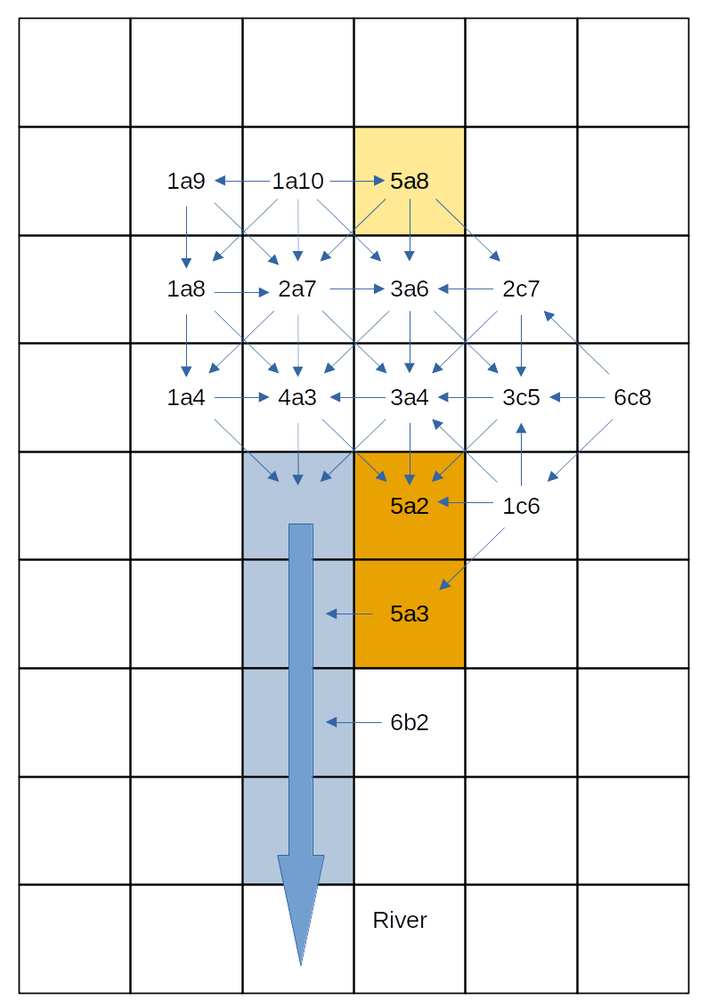
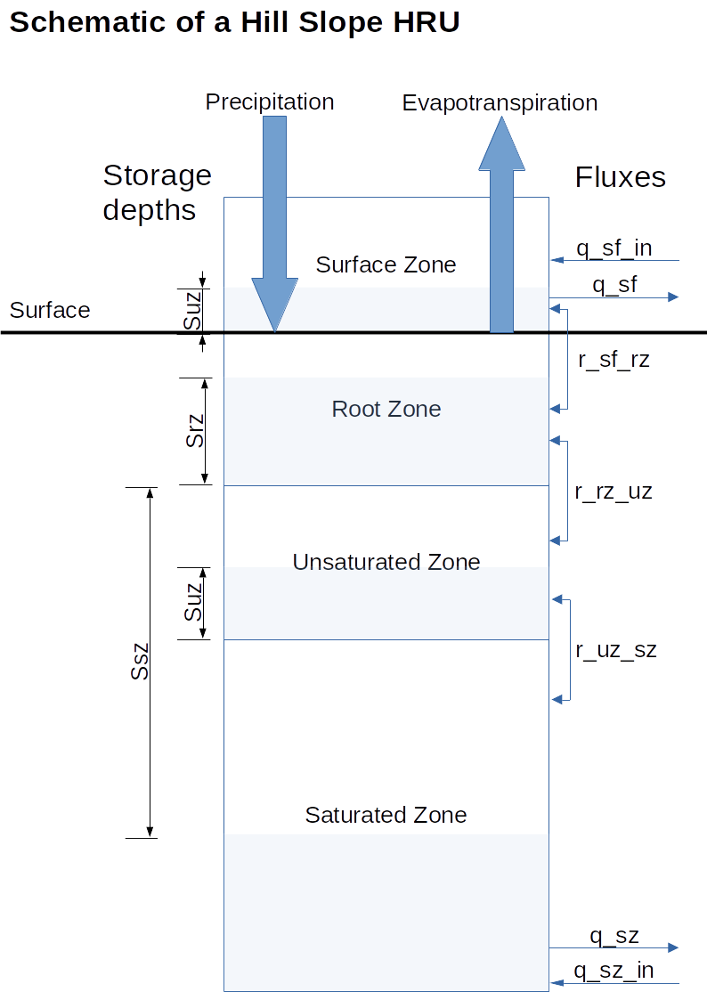

> This a simplified, opinionated introduction. The original motivation for
> Dynamic TOPMODEL can be found in  [Beven & Freer,
> 2001](https://doi.org/10.1002/hyp.252)

## Motivation

Dynamic TOPMODEL was originally conceived as *"A new version of the rainfall-runoff model TOPMODEL
is described in which the assumption of a quasi-steady state saturated zone
configuration is replaced by a kinematic wave routing of subsurface flow..."*
allowing for *"...the simulation of dynamically variable up-slope contributing
areas."*

Revisiting the idea of TOPMODEL (which has done this mainly for hill slopes, but
see [Peters et al. 2003](https://doi.org/10.1002/hyp.1128)) a
model is formulated by

- Classifying the catchment up into areas that respond in a hydrologically
  similar manner
- Determining the connectivity between each of the classes
- Assigning each class to an appropriate Hydrological Representative Unit
  (HRU), which solves the hydrological processes for a standardised unit

In the following these aspects are outlined with reference to the
implementation of Dynamic TOPMODEL in the `dynatop` and `dynatopGIS` packages.

## Classification and Connectivity

### Classification (Part 1)

The location of areas with a hydrological similar response is only every
going to be partially captured by spatial data. Past TOPMODEL and Dynamic
TOPMODEL applications have used classifications based on a topographic index
given by the logarithm of up-slope area divided by the local gradient. Using the
up-slope area gives some spatial ordering to the classes, but (as we will see
with the Eden data) it is not complete. Consider a
small catchment represented by a raster of spatial cells with the following topographic index classes

```{r, echo=FALSE, purl=FALSE, out.width="75%", fig.align="center", fig.cap="Map of topographic index classes"}
knitr::include_graphics("./images/topo_class.png")
```

Since land use could influence the evapotranspiration and infiltration
properties a second classification might be desirable. For the
small catchment the land use classes are shown below

```{r, echo=FALSE, purl=FALSE, out.width="75%", fig.align="center", fig.cap="Map of land use classes"}

```

Combing these topographic index and land use classes gives one initial class
for each unique combination.

### Connectivity

In keeping with earlier spatial analysis TOPMODEL and Dynamic TOPMODEL applications
connectivity (flow directions) is assumed to be determined by the surface
gradient with any down-slope region receiving flow. This gives a high degree of
connectivity between the spatial cells. If a river intercepts a cell it is
assumed that both the surface and subsurface flow direction change to follow
the river course.The following figure shows the
connectivity for the small catchment, with the river cells highlighted in blue.

```{r, echo=FALSE, purl=FALSE, out.width="75%", fig.align="center", fig.cap="Map of combined topographic and land use classes along with connectivity"}
knitr::include_graphics("./images/combined_class.png")
```

### Classification (Part 2)

Each class is represented by a single HRU, the inflows to which are
averaged from the inflows to all the spatial cells of that class. 
Does this make sense for class 5a, which is both in the upper reaches
of the catchment but also adjacent to the river?

The `dynatop` author would argue not. To represent the spatial positioning the catchment can be banded using the connectivity - all cells
in a given band receive flows only from those in a higher band. For the small
catchment this looks like the following

```{r, echo=FALSE, purl=FALSE, out.width="75%", fig.align="center", fig.cap="Map of the band classification"}

```

Combing this into the classification gives

```{r, echo=FALSE, purl=FALSE, out.width="75%", fig.align="center", fig.cap="Map of the combined classification"}

```

which further separates out the 5a class to the areas close to and further
from the river. This demonstrates the banding gives a further level of spatial refinement to the
classification while allowing a for simplification in the catchment representation.

Introducing the band into the classification has a further advantage. Solving
the HRUs starting with those in the highest band ensures that inflows at the
current time step are available for use in the numeric solution. This allow the use of
computation techniques that are more robust to the choice of solution time step.

> The numeric scheme implemented in the `dynatop` package makes use of an
> ordering so that the HRU inflows for the current time step are available. Although
> other options could be used it is **strongly** recommended that the default
> banding scheme is used.

## Hydrological Response Units

Each Hydrological Response Unit HRU represents a parameterised version
of a different part of the hydrological system. The representation of each HRU
is made up of the four zones:

- A *Surface Zone* representing the movement of water on the surface
- A *Root Zone* which controls evapotranspiration, handles the precipitation
  input and flux of water to the unsaturated zone
- A *Unsaturated Zone* which represented the water between the root zone and
the saturated subsurface
- A *Saturated Zone* representing the saturated subsurface

The following schematic shows the four zones and the fluxes between them

```{r, echo=FALSE, purl=FALSE, out.width="75%", fig.align="center", fig.cap="Schematic of the Hill slope HRU"}

```

As shown in the schematic fluxes are passed between the HRUs at two levels,
the surface and the saturated zones. 

To allow for some flexibility in the dynamics of the HRU different
representations can be used for each zone. The governing equation and
numerical solution of these are given in a [vignette of `dynatop`](https://waternumbers.github.io/dynatop/articles/HRU.html). A few
key points are:

- The lateral flow from the Surface and Saturated Zones is computed using
  Muskingham approximations.
- Evapotranspiration is proportional to the percentage saturation of the Root
  Zone
- Flow from the root zone to the Unsaturated Zone can occur only when the Root
  Zone is full
- The Unsaturated Zone is represented by a tank whose time constant depends
  upon the deficit of the Saturated Zone
- The lateral flow from the Saturated Zone is controlled by the saturated
storage deficit through a transmissivity profile.

