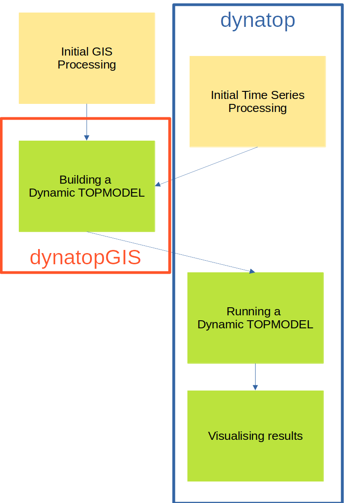

```{r, include = FALSE}
#output: rmarkdown::html_vignette
knitr::opts_chunk$set(
  collapse = TRUE,
  comment = "#>"
)
```

The following schematic outlines the stages resulting a working Dynamic
TOPMODEL for a catchment. It highlights where the `dynatopGIS` and `dynatop`
packages fit into this process. 

```{r, echo=FALSE, out.width="75%", fig.align="center", fig.cap="Schematic of a Dynamic TOPMODEL construction"}

```

As we will see in the example the [`dynatopGIS`](https://waternumbers.github.io/dynatopGIS/index.html) package can help

- Compute standard variables for classification (such as the topographic
  index)
- Build classifications of the catchment
- Construct models suitable for `dynatop`

The [`dynatop`](https://waternumbers.github.io/dynatop/index.html) package allows simulation ans visualation of Dynamic TOPMODELs as well as
providing some helper for processing time series input data.


# Implementation notes

The `dynatopGIS` and `dynatop` packages implement structured, object orientated, data
flows. The packages are written using the object orientated framework
provided by the `R6` package. This means that some aspects of working with the
objects may appear ìdiosyncratic for some R users. In this traing these problems are largely obscured, except for the
call structure. However, before adapting the code, or doing more complex analysis
users should read about `R6` class objects (e.g. in the `R6` package vignettes
or in the Advanced R book). One particular gotcha is when copying an object. Using

```{r eval=FALSE}
my_new_object  <-  my_object
```

creates a pointer, that is altering `my_new_object` also alters
`my_object`. To create a new independent copy of `my_object` use

```{r eval=FALSE}
my_new_object  <-  my_object$clone()
```
