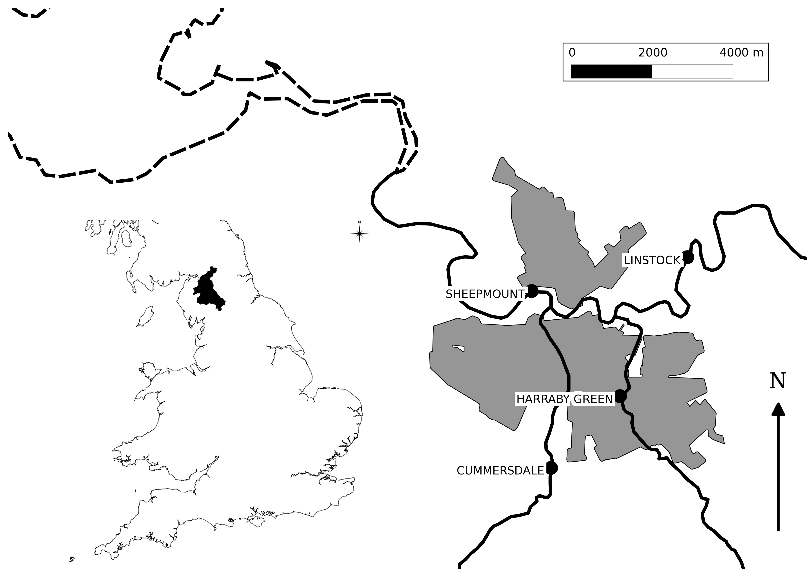

The first half of the training course is working through an example
application based on the Eden Catchment in Cumbria, UK (Figure. At the Sheepmount
gauging station downstream of Carlisle, which is the lowest
monitored point in the catchment, the total area is 2400 km$^2$.

The River Eden and its main tributaries
including the Rivers Eamont, Irthing, Petteril and Caldew link a number of significant
areas for runoff generation which include the northern and eastern parts of the Lake
District; areas of the Northern Pennines and Kielder Forest. These areas are typified by
high annual rainfall totals and steep terrain. Moreover the confluences of two of
these main tributaries lie within the Carlisle urban area resulting in a complex situation
where significant inflows on any tributary may result in flooding.
In January 2005 Carlisle was flooded by an event with an estimated 0.0067 Annual
Exceedance Probability (AEP) at the Sheepmount Gauge (Clarke 2005; Day 2005).
Subsequently to this events in 2010, and particularly 2009, came close to over topping
the main flood defences. The significance of the 2005 flood, combined with a post
event survey of 263 water or wrack marks, has resulted in multiple inundation model
studies (Neal et al. 2009; Horritt et al. 2011; Fewtrell et al. 2011) and
modelling (Leedan et al. 2013, Smith et al. 2013).

```{r, echo=FALSE, out.width="75%", fig.align="center", fig.cap="Map of the River Eden Catchment"}

```

## Available Data

The directory "eden_data/unprocessed" contains the starting data given in the
table below


| File                 | Contents                                                                                                                                                                             |
|----------------------|--------------------------------------------------------------------------------------------------------------------------------------------------------------------------------------|
| Eden_Flow.csv        | Discharge data (m$^3$/s) for the Sheepmount Gauge provided by the environment Agency                                                                                                           |
| Eden_Gauge_Sites.csv | Locations of selected gauges in the Eden Catchment from the [NRFA](https://nrfa.ceh.ac.uk/data/search)                                                                               |
| Eden_Catchment.*     | Outline of the Study area and sub-catchments. Derived from gauge catchments in the [NRFA](https://nrfa.ceh.ac.uk/data/search)                                                         |
| Eden_Urban.*         | Locations of urban areas as used in the 2011 census, from [data.gov.uk](https://data.gov.uk/dataset/15e3be7f-66ed-416c-b0f2-241e87668642/built-up-areas-december-2011-boundaries-v2) |
| Eden_Catchment.*     | Outline of the Study area and sub-catchments. Derived from gauge catchments in the [NRFA](https://nrfa.ceh.ac.uk/data/search)                                                         |
| Eden_River_Network.* | River Network within the catchment. Taken from [OS Open Rivers](https://www.ordnancesurvey.co.uk/business-government/products/open-map-rivers) |
| Eden_DEM.tif | Digital Elevation Model generated by aggregating [OS Terrain 50](https://www.ordnancesurvey.co.uk/business-government/products/terrain-50) to 100m resolution |
| Eden_Precip.nc | A time series of rainfall fields. Derived from the [GPM IMERG](https://gpm.nasa.gov/data/imerg) final product by converting accrued rainfall in m |

<!-- Leedal D., Weerts A.H., Smith P.J. & Beven K.J. Application of -->
<!-- data-based mechanistic modelling for flood forecasting at -->
<!-- multiple locations in the Eden catchment in the National -->
<!-- Flood Forecasting System (England and Wales). Hydrol Earth -->
<!-- Syst Sc i 2013, 17, 177–185. -->
