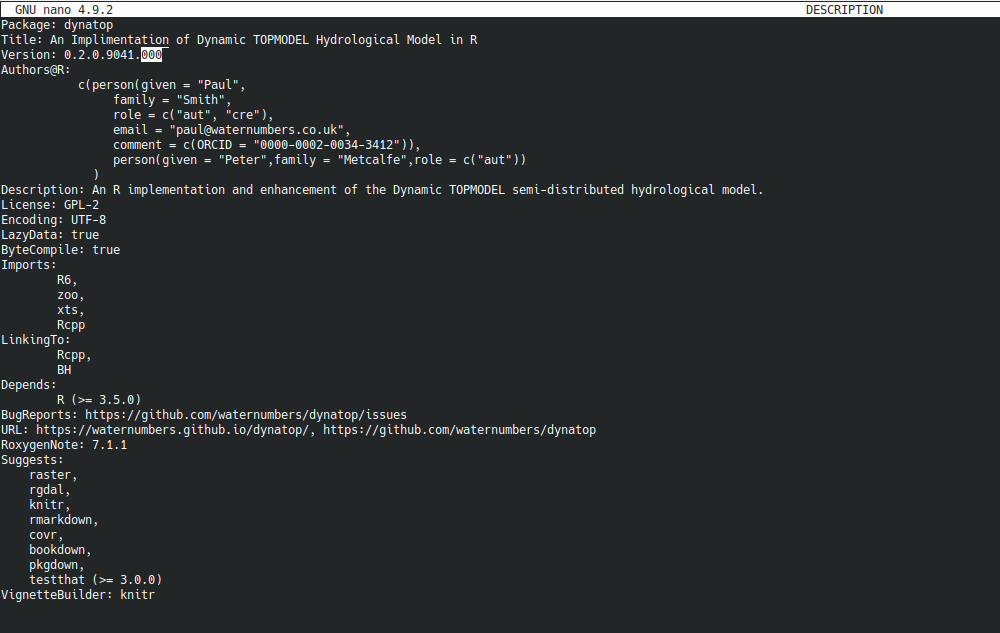

## Aim

To get a basic understanding of Github usage and by forking and cloning the
dynatop repository then making a minor change.


## What is Github?

According to the [Github cheat
sheet](https://training.github.com/downloads/github-git-cheat-sheet.pdf)
Github is *"a platform for hosting and collaborating on Git repositories"* and
Git is *"an open source, distributed version-control system"*

Alternatively on a very basic level Git is a way of keeping track of multiple versions of the same
files as you work on them and Github is platform that allows you to do this
with multiple people. Using Git and Github can be very complex. To go beyond
what is covered here use the cheat sheet and the [Github learning
resources](https://docs.github.com/en/get-started/quickstart/git-and-github-learning-resources).

## Simple usage

1. Log into Github in a web browser and navigate to the [dynatop page on
Github](https://github.com/waternumbers/dynatop). This displays the contents
of the **repository** of projects code (as shown below). A **repository** is the
record kept by Git of changes to the project. Since a repository on a service
such as github is not on your local machine (and may be shared between multiple users) is sometimes referred to as the **remote**
repository.

   ```{r, echo=FALSE, purl=FALSE, out.width="75%", fig.align="center", fig.cap="Github repository of waternumbers"}
   knitr::include_graphics("./images/fork.png")
   ```

2. The dynatop repository does not belong to and you do not have permission to
alter it on Github. The best way for you to alter alter the code
and store it on Github is to **Fork** it (button in top right of web page). This creates your
own copy of the dynatop remote repository.
   

3. To edit the code you will need a copy on your local machine. To do this you
   need to **clone** the git repository. Click on the green code button and copy
   the URL displayed. Open a command prompt on your local
   machine and navigate to the eden_data folder. Enter `git clone <URL>`. The output should look like
   the following
   
   ```{r, echo=FALSE, purl=FALSE, out.width="75%", fig.align="center", fig.cap="Example of the output of a git clone command"}
   knitr::include_graphics("./images/clone_dynatop_cmd.png")
   ```

4. When working on code changes you normally want to the leave the
   currently working code alone. To do this create
   **branch** which can be used as outlined in the figure below.
   
   ```{r, echo=FALSE, purl=FALSE, out.width="75%", fig.align="center", fig.cap="Splitting and merging a branch as part of a workflow"}
   knitr::include_graphics("./images/github_flow.png")
   ```
   
   A new branch is most easily created on the project web page. Create a training
   branch as shown in the image
   
   ```{r, echo=FALSE, purl=FALSE, out.width="75%", fig.align="center", fig.cap="Adding a new branch"}
   
   ```

	Return to the command prompt and type `git checkout training`, to switch to
	working on this branch.

4. Next we will make a simple change to one of the files. Enter the dynatop
   directory and open the DESCRIPTION file. Edit the version number adding
   numeric character as shown below and save it
   
   ```{r, echo=FALSE, purl=FALSE, out.width="75%", fig.align="center", fig.cap="Edited DESCRIPTION file. Highlighted area shows the changes"}
   
   ```
   
5. Return to the command prompt you used before and type
   `git status`. The response should show there is one modified file.
   To add this change to **staging** to show you want to add it to the
   repository type `git add .`. You can **commit** it to the local repository
   with `git commit -m "I've changed the version number!"`. The message is a chance to say what
   changed.
   
6. You have now commited the change to the local repository. To update the
   change to the remote repository enter `git push`. Go to your repository website
   on Github, you should be able to see the changes. If you want to update
   your local repository from the remote teh corresponding call is `git pull`.
   
7. Finally to merge the change back into the master branch you would open a
   pull request. This is most easily done via the project web page as in the
   following figure
   
   ```{r, echo=FALSE, purl=FALSE, out.width="75%", fig.align="center", fig.cap="Opening a pull request"}
   knitr::include_graphics("./images/git_pull.png")
   ```
   There is little point in accepting the pull request as so little has
   been done!
   
   Pull requests can also be made between remote repositories. You could
   reguest a change from your dynatop repository is merged back into the original.
