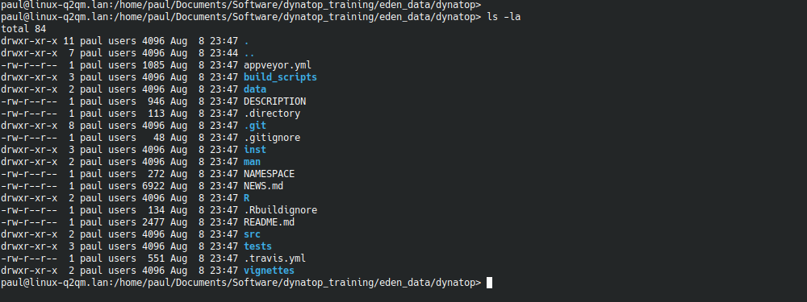
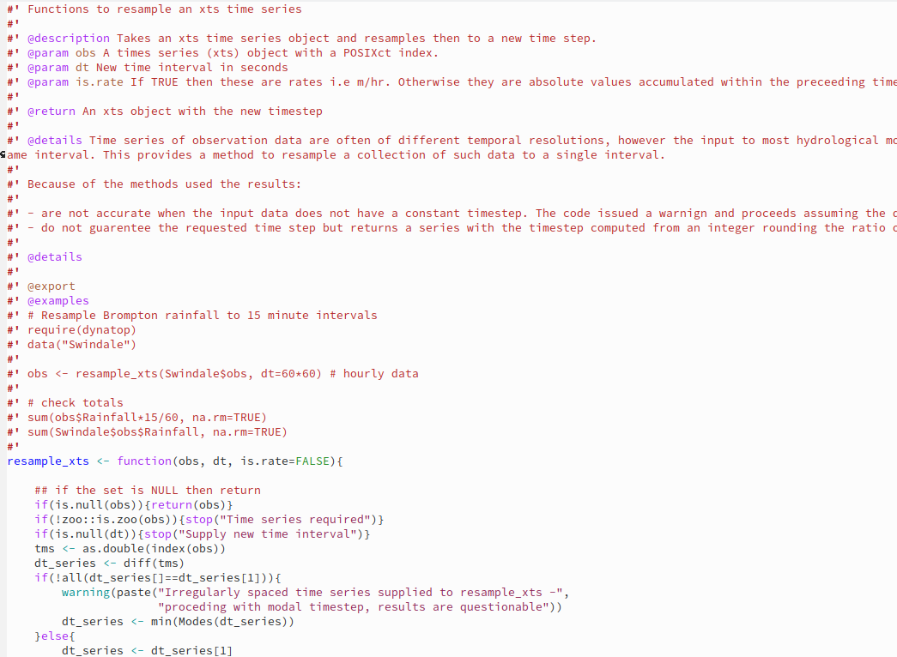

An package is the fundamental unit of shareable code R. Packages bundle
together code, data, documentation, and tests in a redefined template. When
build a package is easy to share with others.

[Writing R extensions](https://cran.r-project.org/doc/manuals/R-exts.html) is
the official manual and reference for package development, but can be a
challenging read. A more accessible description is given in [R Packages
book](https://r-pkgs.org/index.html). The dynatop development broadly follows
the philosophy of expressed in the book that *"anything that can be automated,
should be automated"* though not always using the tools used in the book
(particularly RStudio projects). 

A high degree of automation in the package building is achieved though the use
of further R packages, particularly devtools which can be install with

```{r install_dev, eval=FALSE, purl=FALSE}
install.packages(c("devtools", "roxygen2", "testthat", "knitr", "rmarkdown", "bookdown"))
```

## Package Contents

The following screen shot shows the contents of the cloned dynatop directory

```{r, echo=FALSE, purl=FALSE, out.width="75%", fig.align="center", fig.cap="Contents of the dynatop directory"}

```

Briefly the directories contain:

- R - the R source code
- src - C++ source code
- test - scripts for automatic tests used during the package build
- man - manual pages, these are automatically generated during the package
  build
- vignettes - contains script executed during the build to create longer form
examples and the web page
- build_script - contains scripts and tools for use in building the
package. This does not form part of the build package

Key files within the folder include:

- DESCRIPTION - a description of the package
- NAMESPACE - this controls the the attachment of the package to an R
workspace. Automatically generated as part of the build process so DO NOT edit
by hand
- README.md - A general introduction as seen on the project Github site
- NEWS.md - A change-log of the differences between versions
- .Rbuildignore - controls what files in the dynatop folder are not included
  in the build package
  
## Automatic documentation

Open up the xts_utilities.R file in the R folder. The contents will looks
similar to

```{r, echo=FALSE, purl=FALSE, out.width="75%", fig.align="center", fig.cap="Partial contents of xts_utilities.R"}

```

The initial lines beginning ``#'`` contains material processed by the [roxygen2
package](https://cran.r-project.org/web/packages/roxygen2/vignettes/roxygen2.html)
to produce the function documentation.

The files in the vignettes folder are written in
[Rmarkdown](https://rmarkdown.rstudio.com/) which can be build in different
ways to produce
responsive documents or websites such as the [dynatop
website](https://waternumbers.github.io/dynatop/) - or this training course.
